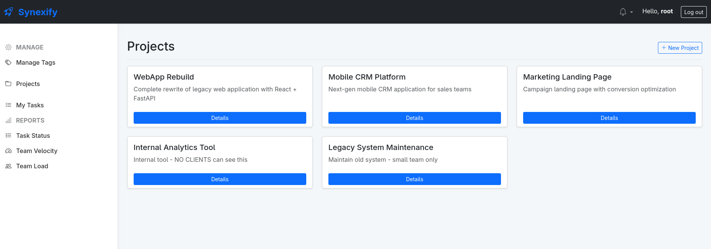
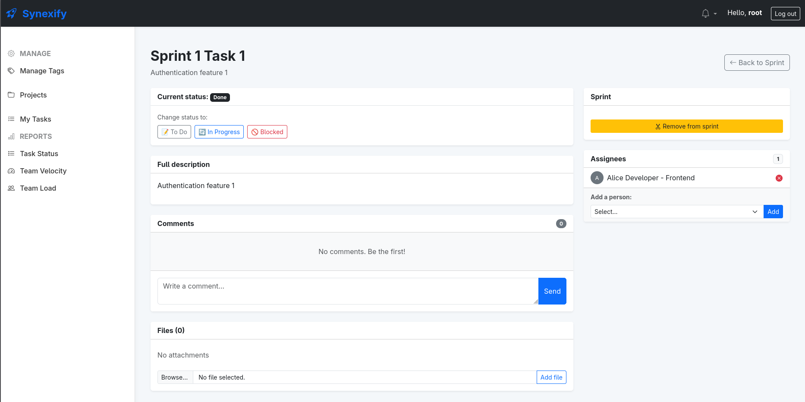

# Synexify

Project Management System implemented in **Python** with **Domain-Driven Design (DDD)** principles.
Supports projects, sprints, tasks, users, notifications, comments, attachments and reporting.

[](https://github.com/boguszera/Synexify/actions)
[](https://codecov.io/github/Boguszera/Synexify) <br>
[](https://github.com/astral-sh/ruff)


---
## Preview
<div align="center">
  <p><b>Project Access Overview</b> – A clear list of all projects assigned to the current user.</p>
  

  <br> <p><b>Task Detailed View</b> - Domain-driven task attributes, comments, and attachments.</p>
  
</div>

___
## Requirements

* Docker ≥ 24
* Docker Compose (built into Docker ≥ 24)
* Linux / macOS / Windows (with WSL or Docker Desktop)
* Git

---

## Environment Setup

### 1. Clone the Repository

```bash
git clone https://github.com/Boguszera/Synexify.git
cd Synexify
```

### 2. Create Environment File

```bash
cp .env.example . env
```

### 3. Configure Environment Variables

Edit `.env` with your settings:

```bash
# Django Settings
DEBUG=True
ALLOWED_HOSTS=127.0.0.1,localhost
SECRET_KEY=your-secret-key-here-change-in-production

# Database Configuration
DB_ENGINE=django.db.backends.postgresql
DB_NAME=synexify_db
DB_USER=postgres
DB_PASSWORD=postgres
DB_HOST=db
DB_PORT=5432
```

---

## Running the Project

### 1. Build and Start Containers

```bash
docker compose up --build
```

This will:
- Build the Django application container
- Start PostgreSQL database container
- Run migrations automatically
- Start the development server on port 8000

### 2. Access the Application

- **Web Application**: http://127.0.0.1:8000/
- **API Documentation**: http://127.0.0.1:8000/api/

---

## Seeding the Database

### Create Sample Data

```bash
docker compose exec web python manage.py seed
```

This creates:

#### 👥 **Demo Users** (Password: `demo123`)

| Login | Role | Email | Projects | Description |
| :--- | :--- | :--- | :--- | :--- |
| `root` | Admin | root@demo.synexify.com | **ALL** | Full system access |
| `admin2` | Admin | admin2@demo.synexify.com | **ALL** | Full system access |
| `manager1` | Manager | manager1@demo.synexify.com | WebApp, Internal Tool | Project lead - WebApp Rebuild |
| `manager2` | Manager | manager2@demo.synexify.com | CRM, Legacy | Project lead - Mobile CRM & Maintenance |
| `manager3` | Manager | manager3@demo.synexify.com | Landing Page | Project lead - Marketing Landing Page |
| `dev1` | Developer | dev1@demo.synexify.com | WebApp, Landing Page | Frontend Specialist |
| `dev2` | Developer | dev2@demo.synexify.com | WebApp, CRM | Backend Specialist |
| `dev3` | Developer | dev3@demo.synexify.com | CRM, Internal Tool | Mobile Developer |
| `dev4` | Developer | dev4@demo.synexify.com | Internal Tool, Legacy | QA & Infrastructure |
| `qa1` | QA | qa1@demo.synexify.com | WebApp, Landing Page | QA - WebApp Testing |
| `qa2` | QA | qa2@demo.synexify.com | CRM | QA - CRM Testing |
| `client1` | Client | client1@demo.synexify.com | WebApp Rebuild | Acme Corp - Client Access |
| `client2` | Client | client2@demo.synexify.com | Mobile CRM | TechStart Inc - Client Access |
| `client3` | Client | client3@demo.synexify.com | Landing Page | Marketing Pro - Client Access |

#### 📦 **Sample Data**

* **5 Projects:**
    * **WebApp Rebuild** – Complete rewrite with React + FastAPI *(manager1, dev1, dev2, qa1, client1)*
    * **Mobile CRM Platform** – Next-gen mobile CRM *(manager2, dev2, dev3, qa2, client2)*
    * **Marketing Landing Page** – Campaign with conversion optimization *(manager3, dev1, qa1, client3)*
    * **Internal Analytics Tool** – Internal only, NO client access *(manager1, dev3, dev4)*
    * **Legacy System Maintenance** – Maintenance work, NO client access *(manager2, dev4)*
* **8 Sprints:**
    * **Project 1:** 3 sprints (1 completed, 2 active)
    * **Project 2:** 1 sprint (active)
    * **Project 3:** 1 sprint (active)
    * Plus planning sprints for Projects 4 & 5
* **35+ Tasks:**
    * Multiple types: Features (with story points), Bugs (with severity), Chores
    * Statuses: To Do, In Progress, Done
    * Distributed across all projects and assigned to team members
* **9 Tags:** `backend`, `frontend`, `urgent`, `review`, `api`, `ux`, `devops`, `mobile`, `database`
* **3 Comments:** Task collaboration and team feedback examples

---

## API Endpoints

### Authentication

```bash
# Login
POST /api/auth/login/
{
  "username": "dev1",
  "password": "demo123"
}

# Refresh Token
POST /api/auth/refresh/
{
  "refresh": "token_here"
}
```

### Projects

```bash
GET    /api/projects/              # List all projects
POST   /api/projects/              # Create new project
GET    /api/projects/{id}/         # Get project details
PATCH  /api/projects/{id}/         # Update project
DELETE /api/projects/{id}/         # Delete project
```

### Sprints

```bash
GET    /api/sprints/               # List all sprints
POST   /api/sprints/               # Create sprint
GET    /api/sprints/{id}/          # Get sprint details
PATCH  /api/sprints/{id}/          # Update sprint
DELETE /api/sprints/{id}/          # Delete sprint
POST   /api/sprints/{id}/add_task/ # Add task to sprint
GET    /api/sprints/{id}/tasks/    # Get sprint tasks
```

### Tasks

```bash
GET    /api/tasks/                 # List all tasks
POST   /api/tasks/                 # Create task
GET    /api/tasks/{id}/            # Get task details
PATCH  /api/tasks/{id}/            # Update task
DELETE /api/tasks/{id}/            # Delete task
PATCH  /api/tasks/{id}/assign/     # Assign user
POST   /api/tasks/{id}/add_comment/        # Add comment
GET    /api/tasks/{id}/comments/   # Get comments
POST   /api/tasks/{id}/add_attachment/     # Upload file
GET    /api/tasks/{id}/attachments/# Get attachments
```

### Reports

```bash
GET /api/reporting/dashboard/      # Dashboard overview
GET /api/reports/status/           # Task status summary
GET /api/reports/workload/         # Team workload
GET /api/reports/velocity/         # Team velocity
```

---

## Key Features by Role

### 👨‍💼 **Admin**
- Manage all users
- Manage all projects
- Access all reports
- System configuration

### 👔 **Manager**
- Create & manage projects
- Plan sprints
- Assign tasks
- View team workload
- Generate reports

### 👨‍💻 **Developer**
- View assigned tasks
- Update task status
- Add comments
- Upload attachments
- Track progress

### 👥 **Client**
- View assigned projects
- Track progress
- Add comments
- View reports (limited)

---

## Database Schema

The system uses PostgreSQL with the following main entities:

- **Users** - User accounts with roles
- **Projects** - Project organization
- **Sprints** - Sprint planning containers
- **Tasks** - Work items (Features, Bugs, Chores)
- **Comments** - Task discussions
- **Attachments** - File uploads
- **Tags** - Task categorization
- **Notifications** - User notifications

---

## Development

### Create Migrations

```bash
docker compose exec web python manage.py makemigrations
docker compose exec web python manage.py migrate
```

### Access Django Shell

```bash
docker compose exec web python manage.py shell
```

### View Logs

```bash
docker compose logs -f web
docker compose logs -f db
```

### Code Quality (Linter & Formatter)

This project uses **Ruff** for fast linting and code formatting. To contribute to this project, you must install the git hooks locally:


```bash
# 1. Install pre-commit on your local machine
pip install pre-commit

# 2. Activate hooks for this repository
pre-commit install
```

### Run linter checks
```bash
docker compose exec web ruff check .
```

### Run auto-formatter
```bash
docker compose exec web black .
```

### Run tests
```bash
docker compose exec web pytest
```
---

## Troubleshooting

### Database Connection Issues

```bash
# Restart database
docker compose down
docker compose up -d db
docker compose up web
```

### Permission Denied Errors

```bash
# Check file permissions
docker compose exec web chmod -R 755 /app/media/
```

### Clear Cache & Rebuild

```bash
docker compose down -v  # Remove all volumes
docker compose up --build
```

---

## Technology Stack

- **Backend**: Django 5.2, Python 3.12
- **Database**: PostgreSQL 16
- **API**: Django REST Framework with JWT
- **Code Quality**: Ruff (Linter) & Black (Formatter)
- **Tests**: Pytest
- **Architecture**: Domain-Driven Design (DDD)
- **Containerization**: Docker & Docker Compose
- **Frontend**: Bootstrap 5

---

## Architecture Principles

This project follows **Domain-Driven Design (DDD)**:

- **Domain Layer** (`domain/`) - Pure business logic
- **Application Layer** (`application/`) - Use cases and Application Services
- **Infrastructure Layer** (`infrastructure/`) - Technical implementation
- **Presentation Layer** (`api/`, `web/`) - User interfaces

*Note: The standard Django Admin Panel has been deliberately disabled to prevent bypassing the Domain Layer and direct ORM manipulation.*

---

## License

Apache License 2.0 - See LICENSE file for details

---

## Support

For issues and questions:
- Open an issue on GitHub
- Check existing issues for solutions
- Review documentation in code comments

---

## Author

**Boguszera** - Project Creator
